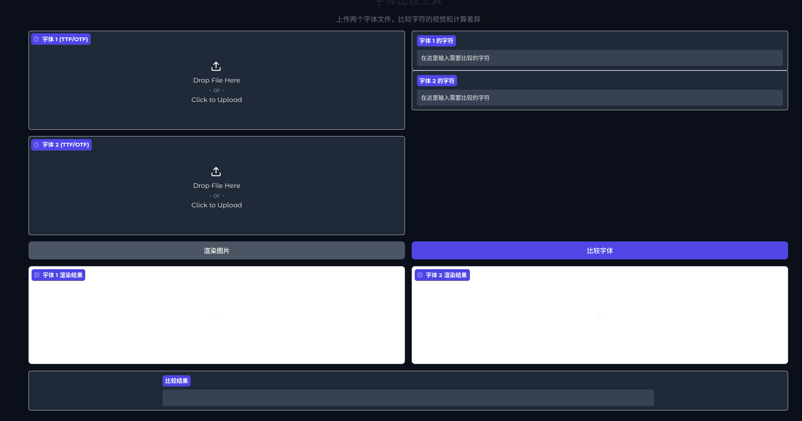
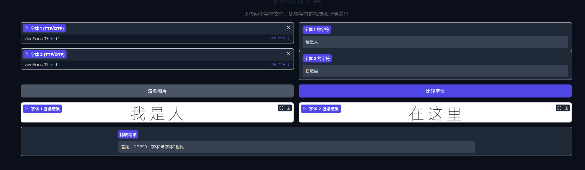

# FontDreamer

一个基于 Gradio 的字体视觉比较小工具，支持上传两种字体文件，输入待比较字符，模型会自动渲染并评估两组字符的视觉差异，帮助用户判断字体的相似度。

---

## ✨ 功能介绍

- 🎯 **模型加载**：支持加载 `.safetensors` 格式的权重，使用自定义 `SiglipEecoder` 模型进行特征提取与相似度计算。
- 🖼️ **字体渲染**：输入字符内容，自动用两种字体绘制对比图像。
- 📏 **相似度比较**：通过模型计算两组字体的字符特征距离，量化视觉差异。
- 💡 **简洁UI**：基于 Gradio 快速搭建，轻松交互，适配桌面和网页。

---

## 📦 安装依赖

确保已安装 `Python 3.8+`，然后运行：

```bash
pip install gradio safetensors torch numpy
```

---

## ⚙️ 使用说明

1️⃣ **准备模型文件**  
将训练好的 `.safetensors` 模型权重放入 `Model/model_data/` 文件夹下，并命名为：  
```
model.safetensors
```

2️⃣ **启动项目**  
运行 Python 文件，自动加载模型并打开 Gradio 网页界面：

```bash
python classify-webui.py
```

3️⃣ **网页界面操作**


- 上传两个字体文件（支持 `.ttf` / `.otf`）。
- 输入要比较的字符，系统会自动渲染字符图片并展示。
- 点击【比较字体】按钮，获取两组字体字符的相似度分数，帮助判断是否风格接近。

---

## 💡 注意事项

- 模型默认输入图片尺寸为 `64x64`，字符渲染采用灰度图计算特征距离。
- 字体差距评分：  
  - 分值 `< 0.5`：两种字体非常相似  
  - 分值 `>= 0.5`：两种字体风格明显不同  

---

## 🧠 目录结构

```
├── Model
│   ├── VisionEncoder.py        # SiglipEecoder模型定义
│   └── model_data
│       └── model.safetensors   # 模型权重文件
├── Utils
│   └── FontData.py             # 字体绘制工具
├── classify-webui.py       # 主程序文件
└── README.md                   # 使用说明文档
```

---

## 💻 示例截图

---

## 📢 致谢

- 本项目基于 `Gradio` 构建界面，使用 `PyTorch` 加载模型，适用于字体特征对比、风格分析等任务。
